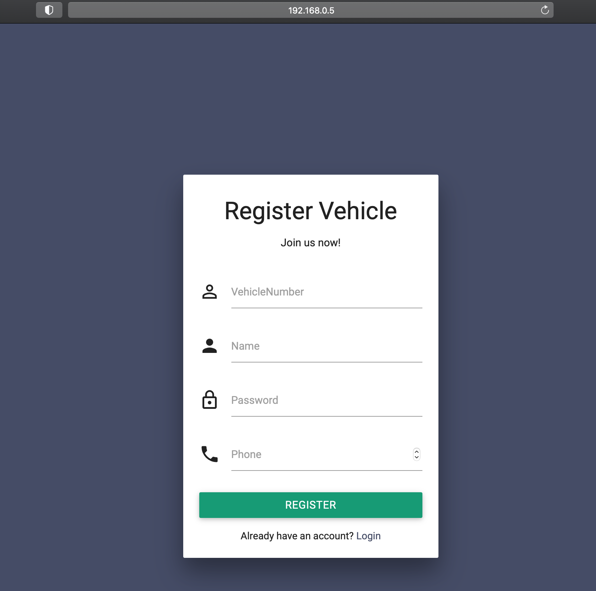

# Junusha Food App

## Screenshots
### Login

### Register

### Login Vehicle

### Register Vehicle

### Modify Food Menu (Admin)

### Food Menu (Customer)

### Delivery/Payment Details

### Confirming Order

### View all Orders(Admin)

### User Management(Admin)

### Order Management(Admin)

### DB SQL Management(Admin)

How To Install -
---------

1a. Create Database food using XAMPP.
1b. copy junusha folder to xamppfiles/htdocs/ and click on Refresh in Browser (if needed).
2. Run food.sql script provided in sql folder onto XAMPP via ip_address for e.g : 127.0.0.1/myphpadmin.
3. scan the QR-Code images as recommended in qr_code_generator/README.md
4. Read from 4a,5a,6a based on UseCase.
5. access db directly http://192.168.0.5/phpmyadmin/ on XAMPP

Note -
---------
1. The username and password of sample users are stored in table `users`.
2. Only Customers with "Verified" status can place orders using "Cash on Delivery" option (default Verified=True).
3. By default a new customer gets 100 coins in Wallet on signing up,

#### TABLE WALKIN/DINE-IN
4a. scan a printed out qr_code_generator/images/table1.png for TABLE_1 DINE-IN  
4b. scan a printed out qr_code_generator/images/table2.png for TABLE_2 DINE-IN  
4c. scan a printed out qr_code_generator/images/table3.png for TABLE_3 DINE-IN  
4d. all TABLE_1,TABLE_2,TABLE_3 will come to auto-login-table1.php,auto-login-table2.php,auto-login-table3.php
with username and password pre-filled.

4e. Click On Login to access the food menu and place orders 

4f. Click on Order after entering item counts as needed.

4g. Choose between Wallet/COD/TakeAway as needed and click Submit.

4h. click on "Confirm Order" after reviewing your details.

4i. Check Existing Orders raised by you by clicking Orders>ALL Orders on the left side tabs.

#### ONLINE-ADS
5a. scan a printed out qr_code_generator/images/login.png for ONLINE-ADS  
5b. login.php will get loaded with Login screen with option to Register for new user.

5c. (one-time-registration per customer) : Register once and use the username/password in 5d.

5d. Click On Login to access the food menu and place orders 

5e. Click on Order after entering item counts as needed.

5f. Choose between Wallet/COD/TakeAway as needed and click Submit.

5g. click on "Confirm Order" after reviewing your details.

5h. Check Existing Orders raised by you by clicking Orders>ALL Orders on the left side tabs.

#### DRIVE_THRU/VEHICLE CALLOUT
6a.scan a printed out qr_code_generator/images/login_vehicle_number.png for DRIVE_THRU/VEHICLE CALLOUT  
6b. login_vehicle_number.php will get loaded with diff Login screen with VehicleNumber option to Register for new user/Vehicle.

6c. (one-time-registration per customer) : Register once and use the username/password in 5d.

6d. Click On Login to access the food menu and place orders 

6e. Click on Order after entering item counts as needed.

6f. Choose between Wallet/COD/TakeAway as needed and click Submit.

6g. click on "Confirm Order" after reviewing your details.

6h. Check Existing Orders raised by you by clicking Orders>ALL Orders on the left side tabs.

#### ADMINISTRATOR

7a.scan a printed out qr_code_generator/images/login.png 
and login using root/toor

7b. modify items as needed and also can add new items

7c. modify order status as needed

7d. modify users as needed and can add new users
NOTE: This is also possible by directly accessing the http://192.168.0.5/phpmyadmin/ provided you are on the sql-server